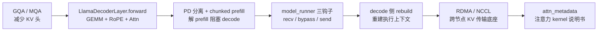
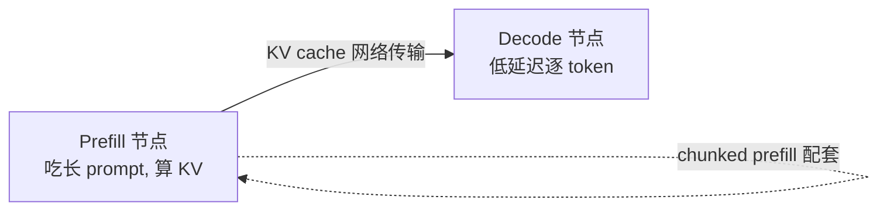

# vLLM 推理系统面试口述稿（知识链总览）

> 适用方向：AI Infra / 推理系统 / CUDA 推理优化岗。
> 用法：先背「知识链总览」建立全局观，再按主题逐块口述；每个主题含「一句话定位 + 逐行/逐点讲解 + 高频追问」。
> 风格：中文、结构化、先概览+流程图，再拆解。

---

## 0. 知识链总览（先建立全局观）

一条主线把下面所有主题串起来，面试时可以用这条线把零散知识点串成一段完整叙述：

```
模型结构(GQA) → 单层计算(forward / GEMM) → 调度优化(PD 分离 / chunked prefill)
            → KV 传输实现(connector 三钩子 + rebuild) → 通信底座(RDMA / NCCL)
            → 注意力元数据(attn_metadata)
```



---

## 1. GEMM 与 GQA / MQA

### 1.1 GEMM（面试定位：深度学习的计算原语）

- **定义**：`C[M×N] = A[M×K] × B[K×N]`，最朴素的矩阵乘矩阵。
- **地位**：深度学习 90%+ 算力花在 GEMM 上——全连接、embedding 投影、attention 里的 QKV 投影（`qkv_proj`）、输出投影（`o_proj`）、MLP 两层线性都是 GEMM。
- **与 forward 代码对应**：`qkv_proj(hidden_states)` 背后就是一次 GEMM：
  - `A = hidden_states` → `[B*N, hidden_size]`
  - `B = Linear 权重` → `[hidden_size, q_size + 2*kv_size]`
  - 输出 → `[B*N, q_size + 2*kv_size]`
- **为什么推理优化围着它转**：GEMM 计算密集、可预测，极度依赖显存带宽与 Tensor Core。手段：量化（W8A8 / W4A16）、更好 kernel（CUTLASS / Marlin / cuBLAS）、算子融合（合并多个小 GEMM）。

### 1.2 MHA / GQA / MQA（面试定位：KV head 数量决定 KV cache 大小）

三者都是多头注意力，区别在于 **K 和 V 的 head 数量**：

| 方案 | Q heads | KV heads | KV cache 相对大小 | 代表模型 | 特点 |
|------|---------|----------|------------------|----------|------|
| MHA | 32 | 32 | 32x | GPT-2/3, BERT | 每 Q head 配独立 KV，质量最好但 KV 最大 |
| GQA | 32 | 8 | 8x | **Llama-2/3, Mistral, Gemma** | Q head 分组共享 KV，质量/速度折中，当前主流默认 |
| MQA | 32 | 1 | 1x | PaLM | 所有 Q 共享 1 份 KV，最快但质量下降 |

- **与代码对应**（关键）：
  ```python
  q, k, v = qkv.split([self.q_size, self.kv_size, self.kv_size], dim=-1)
  ```
  - `q_size = num_q_heads × head_dim`，`kv_size = num_kv_heads × head_dim`
  - GQA 下 `num_kv_heads < num_q_heads`，所以 `kv_size < q_size`。`kv_size` 出现两次（K、V 各一份且相同），小于 Q 的那一份 → 正说明用的是 GQA。

**一句话**：GEMM 是计算原语，attention 所有投影本质都是 GEMM；MHA/GQA/MQA 的区别在 KV head 数，代码里 `split([q_size, kv_size, kv_size])` 中 `kv_size < q_size` 即 GQA 的证据。

---

## 2. LlamaDecoderLayer.forward 逐行（面试定位：经典手写+追问题）

### 2.1 照着能背的代码（截图版，省略了 norm/residual）

```python
def forward(
    self,
    positions: torch.Tensor,        # 当前 token 位置索引
    hidden_states: torch.Tensor,    # 输入: [B, N, hidden_size]
) -> torch.Tensor:
    qkv, _ = self.qkv_proj(hidden_states)                 # 1) 合并投影到 QKV
    q, k, v = qkv.split([self.q_size, self.kv_size,
                         self.kv_size], dim=-1)           # 2) 切出 Q/K/V
    q, k = self.rotary_emb(positions, q, k)               # 3) 对 Q/K 做 RoPE
    attn_output = self.attn(q, k, v)                      # 4) 注意力
    output, _ = self.o_proj(attn_output)                  # 5) 投影回 hidden
    return output
```

> 真实 Llama 是 pre-norm + residual，常见写法：`residual = hidden_states → input_layernorm → self_attn → residual+ → post_attention_layernorm → mlp → residual+`。

### 2.2 逐行讲解（口述版）

| 行 | 代码 | 在做什么 | 面试深挖点 |
|----|------|---------|-----------|
| 1 | `positions: torch.Tensor` | 当前 token 位置索引，不是直接传 cos/sin | 为什么不用 attention_mask？RoPE 是相对位置编码 |
| 2 | `hidden_states: torch.Tensor` | 输入 `[B, N, hidden_size]` | prefill 时 N 大；decode 时 N=1 |
| 3 | `qkv, _ = self.qkv_proj(...)` | hidden 投影到 Q+K+V 合并空间 | **为什么合并成一个 proj？** 合并成大 GEMM，kernel launch 更少、访存更连续、吞吐更高 |
| 4 | `qkv.split([q_size, kv_size, kv_size], dim=-1)` | 最后一维切三块 | `kv_size` 两次 → GQA/MQA，KV head ≤ Q head |
| 5 | `q, k = self.rotary_emb(positions, q, k)` | 对 Q、K 做旋转位置编码 | **为什么只加 Q/K 不加 V？** attention 算 Q·K^T，位置信息只需在 QK 内积体现；V 不参与位置比较 |
| 6 | `attn_output = self.attn(q, k, v)` | 核心注意力 | prefill 是 N×N dense（compute-bound）；decode 是 1×N（memory-bound） |
| 7 | `output, _ = self.o_proj(...)` | attention 输出投影回 hidden | 第二个返回值 `_` 是 bias/辅助输出，忽略 |

### 2.3 常见追问

- **Q：为什么 `qkv_proj` 合并？** 减少算子数、连续访存、cuBLAS 易打满；vLLM 还常把 `qkv_proj + rotary + attention` 做成 fused kernel。
- **Q：decode 与 prefill 这段代码差异？** 同一段代码、不同输入形状：prefill `[B,N,H]` 走 dense kernel；decode `[B,1,H]` 走 paged decode kernel，瓶颈从计算变 KV 读取。
- **Q：`dim=-1` 是什么？** "在最后一个维度操作"；特征维永远在最后，对任意形状稳健（不怕输入变成 2 维）。

---

## 3. Prefill-Decode 分离（PD Disaggregation）

### 3.1 痛点（为什么要有 PD 分离）

| 阶段 | 输入 | Attention 形态 | 计算量 | 主要工作 |
|------|------|---------------|--------|----------|
| Prefill | 整个 prompt（N token） | Q/K/V 都是 N，`N×N` | 大（heavy GEMM） | 生成并写入 KV cache |
| Decode | 当前 1 token | Q 是 1，K/V 从 cache 读 | 小（1×N） | 产出下一个 token |

最初调度优先做 prefill（吞吐高），但一个长 prefill 长时间占 GPU，导致所有 decode 被卡——TTFT 与 TBT 同时恶化。

### 3.2 解法



- **PD 分离**：prefill 与 decode 拆到不同实例/节点，prefill 算完 KV 通过网络传给 decode。prefill 专心提吞吐，decode 保持低延迟不被打断。
- **chunked prefill（配套）**：长 prompt 切片，每片当作小 prefill 与 decode 交错，降低对 decode 的阻塞。
- **PD 分离 ≠ chunked prefill**：前者跨实例、解决资源配比；后者同实例、解决单次 prefill 阻塞。

**一句话**：同一段 forward 里 prefill 是 N→N 重计算、decode 是 1→N 轻计算，混跑互相阻塞，故拆开 + chunked prefill，兼顾吞吐与低延迟。

---

## 4. model_runner KV 传输三钩子（vLLM 源码实现）

### 4.1 三个钩子（落在 `worker/model_runner.py`，V0 engine）

```python
bypass_model_exec = False
if self.need_recv_kv(model_input, kv_caches):                 # forward 前
    hidden_or_intermediate_states, bypass_model_exec, model_input = \
        get_kv_transfer_group().recv_kv_caches_and_hidden_states(
            model_executable, model_input, kv_caches=kv_caches)  # blocking, inject

if not bypass_model_exec:                                     # forward 中
    with set_forward_context(model_input.attn_metadata, ...):
        hidden_or_intermediate_states = model_executable(...)

if self.need_send_kv(model_input, kv_caches):                 # forward 后
    get_kv_transfer_group().send_kv_caches_and_hidden_states( # non-blocking, extract
        model_executable, model_input, kv_caches,
        hidden_or_intermediate_states)
```

| 钩子 | 作用 | 面试要点 |
|------|------|---------|
| `recv_kv_caches_and_hidden_states` | **阻塞**接收远端 KV + hidden，注入 paged memory | `bypass_model_exec=True` 跳过 prefill |
| `if not bypass_model_exec` | 未收全 KV 则正常跑 prefill forward | decode 起手时已被接管 |
| `send_kv_caches_and_hidden_states` | **非阻塞**提取 paged KV 发出去 | 同时传 hidden states，减少 decode 重算 |

### 4.2 为什么钩子必须落在 model_runner

scheduler 看不到 paged buffer 物理块指针（指针只在 worker 进程）；data move 必须在 worker 的 forward 边界。

### 4.3 pooling vs p2p / connector API

| 维度 | pooling mode（池化） | p2p mode（点对点） |
|------|---------------------|-------------------|
| 传输方式 | prefill 把 KV 放进共享 KV 池，decode 去取 | prefill 直连发给目标 decode |
| 优点 | 可跨请求前缀复用（prefix caching） | 路径短、延迟低 |
| 缺点 | 池子有存储/网络瓶颈 | prefill/decode 需互相知道，耦合高 |

- **connector API**：vLLM 对 KV 传输的统一抽象，底层可插拔：`LMCache`（Berkeley，offload/disagg）、`MoonCake`（月之暗面，长上下文 KV-centric）、`NIXL`（NVIDIA inference xfer）、`P2pNcclConnector`（NCCL GPU 通信）。
- **V0 → V1 演进**：粗粒度一次性 recv → 细粒度逐层 `wait_for_layer_load` / `save_kv_layer`；需 `requires_piecewise_for_cudagraph=True` 解决层wise sync 的图捕获限制。

---

## 5. decode 侧 rebuild 过程（接着上一步）

### 5.1 为什么需要 rebuild

prefill 与 decode 是**两个独立 vLLM 实例**。prefill 实例 send 出去的不只是 KV cache 张量，还有 **sequence state 元数据**（官方原话："outputs the generated KV cache along with necessary metadata (e.g., sequence state)"）。decode 拿到 KV 后不能凭空接着生成，必须先用元数据把自己的执行上下文重建一遍。

### 5.2 重建哪几样

| 重建项 | 是什么 | 不重建会怎样 |
|--------|--------|-------------|
| ① 序列状态 SequenceGroup | 注册成 decode 请求，带 seq_len / position / 状态标记 | 调度器不认识，不排它进 batch |
| ② paged block table | 指针指向已接收的 KV block | 注意力算子找不到 KV |
| ③ attn_metadata | 供 `set_forward_context` 的注意力元数据 | 算子不知 KV 已就绪、按错误长度算 |
| ④ hidden states（可选） | 接收末层 hidden 跳过前几层重算 | 否则至少要部分重算 |

### 5.3 两种 transfer mode

| 模式 | 谁发起 | decode 何时 rebuild | 特点 |
|------|--------|---------------------|------|
| read mode | decode 主动拉 | prefill 算完 → 拿 block 位置 → 拉 KV → rebuild | 编排简单，TTFT 略高 |
| write mode | prefill 边算边推 | 每算完一层 push 进 decode → 几乎即时 rebuild | 延迟更低，耦合更高 |

**一句话**：rebuild = decode 根据 sequence state，重建调度/分页/注意力上下文，才能 `bypass_model_exec` 并以 1-token forward 接着生成。

---

## 6. 通信底座：RDMA 与 NCCL

### 6.1 RDMA（远程直接内存访问）

- **定义**：一台机器的网卡直接读写另一台机器的内存/显存，**绕过对方 CPU 和操作系统内核**。
- **对比 TCP/IP**：数据零拷贝、不占 CPU、亚微秒延迟、近线速吞吐。
- **GPUDirect RDMA**：网卡与 GPU 显存直接 DMA 互通，省掉主机内存一次拷贝。完整快路径：prefill GPU 显存 → prefill 网卡 → 网络 → decode 网卡 → decode GPU 显存。
- **实现**：InfiniBand（专用、性能最好）、RoCE（以太网跑 RDMA、性价比高）、iWARP（最弱）。

### 6.2 NCCL（NVIDIA 集合通信库）

- **定位**：多 GPU/多节点的集合通信库，PyTorch 分布式、TP、MoE 的通信底座。自己不实现传输，节点内走 **NVLink**、跨节点走 **RDMA**。
- **原语**：

| 原语 | 作用 | 用在哪 |
|------|------|--------|
| all-reduce | 各 GPU 数据归约后人人有结果 | TP 每层激活同步、DP 梯度同步 |
| all-gather | 各持一段，收集后人人有完整 | TP 拼各 head 输出 |
| reduce-scatter | 先归约再分散 | 配合 all-gather 组成 TP 反向 |
| broadcast | 一份发给所有人 | 初始化/分发权重 |
| all-to-all | 每 GPU 发给每 GPU 不同数据 | **MoE 专家并行** token 路由 |

**一句话**：RDMA 是传输层（绕过 CPU 直传显存），NCCL 是架在它上面的集合通信调度层（节点内 NVLink、跨节点 RDMA，自动选 ring/tree 拓扑）。PD 分离 KV 直传、TP all-reduce、MoE all-to-all 全靠它们压低延迟。

---

## 7. attn_metadata（注意力 kernel 的说明书）

### 7.1 是什么

vLLM 注意力计算是"通用 kernel + 元数据"分离。每个 attention 层只拿 Q/K/V 张量，但**不知道**序列结构（谁和谁一组、多长、KV 在哪）。这些信息全部塞进 `attn_metadata`，由 `set_forward_context` 在 forward 前注入，逐层 attention 读取。

### 7.2 核心字段

| 字段 | 含义 | attention 为什么需要 |
|------|------|---------------------|
| `seq_lens` / `seq_lens_tensor` | 每个序列当前总长度 | 决定每个 query attend 多少 KV |
| `block_tables` | 序列 → 占用的 paged KV block 列表 | **PagedAttention 按 block 取 KV 的地址表** |
| `slot_mapping` | 每个 token → paged 显存具体 slot | 写/读 KV 落哪个格子 |
| `num_prefill_tokens` | 这批里 prefill 的 token 数 | 区分 prefill step 还是 decode step |
| `is_prompt` | 是否首 prefill step | kernel 路由：FlashAttention 还是 PagedAttention |
| `context_lens` | 各序列已有 KV 缓存长度（decode 用） | 知道读多长历史 KV |

### 7.3 Prefill vs Decode 走不同元数据（面试必考）

| | Prefill（FlashAttention） | Decode（PagedAttention） |
|---|---|---|
| 计算形态 | N×N 连续，同批一起算 | 1×N，逐 token 查 paged KV |
| 关键元数据 | `query_start_loc` / `seq_start_loc` / `max_seq_len` | `block_tables` / `context_lens` / `slot_mapping` |
| 要不要 block_table | **不要**（序列连续直接算） | **要**（KV 散落 paged block） |

→ 这正是 PD 分离里 decode 侧必须 **rebuild attn_metadata** 的原因：要让 `block_tables` 指向已接收的 KV block、`seq_lens` 设成完整 prompt 长度、`is_prompt=False`。

---

## 8. 面试收尾 & 高频追问清单

### 8.1 30 秒总览（可当开场白）

> "这次准备围绕 vLLM 推理系统串一条线：模型用 GQA 减少 KV 头；单层 forward 里 qkv_proj 是合并 GEMM、split 体现 GQA、RoPE 只加 Q/K；同一个 forward 在 prefill 是 N×N、decode 是 1×N，混跑互相阻塞，所以用 PD 分离 + chunked prefill；vLLM 在 model_runner 加 recv/bypass/send 三钩子做 KV 传输，decode 侧收到 KV + sequence state 后要 rebuild 执行上下文；跨节点 KV 传输靠 RDMA/NCCL，注意力 kernel 靠 attn_metadata 当说明书。"

### 8.2 可能被追问的方向（提前准备）

1. **算子层**：FlashAttention / PagedAttention 原理、算子融合、W8A8/W4A16 量化 kernel。
2. **调度层**：continuous batching、chunked prefill、PD 分离两种模式权衡。
3. **KV 管理**：PagedAttention 怎么解决碎片、prefix caching、KV cache 量化。
4. **通信层**：NVLink vs RDMA 带宽量级、NCCL ring/tree、all-to-all 在 MoE 的通信量。
5. **系统层**：TP/PP/DP 切分边界、GPUDirect、speculative decoding。
6. **源码层**：V0→V1 connector 演进、CUDA Graph 与 layerwise hook 冲突（piecewise graph）。

---

*整理自 2026-08-03 的 vLLM 源码面试陪练对话。*
