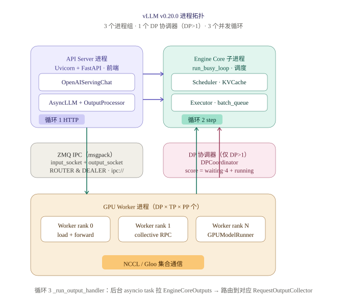
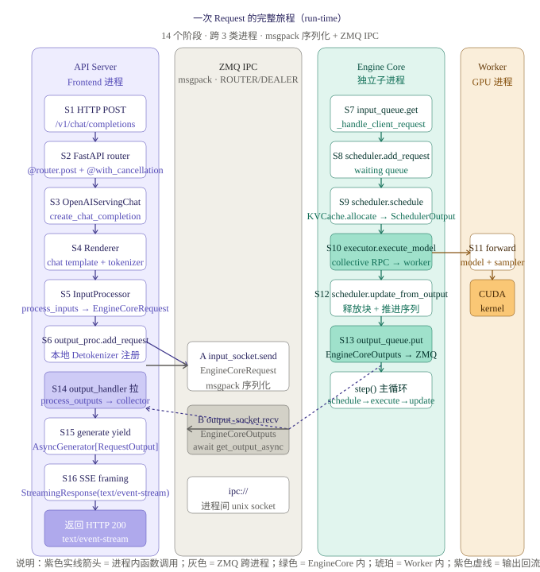

# vLLM v0.20.0 — 一次 Request 的完整旅程（源码级）

> 来源：B 站《vLLM 小课堂（三）：一个 Request 的完整旅程》（温国鸿 / 汪志鹏）+ 后续源码逐行走读
> 锁定版本：vLLM `v0.20.0`（commit `88d34c6409e9...`）
> 验收标准：能在 30 秒内回答「一次 HTTP chat/completions 调用到底跨过几层、每层在哪段代码、传什么数据」。
> 行号均以本地 `external/vllm-v0.20.0/` 源码核对。

## 0. 一句话总结

v0.20.0 把 v0.5 时代的「all in one」主进程拆成 **API Server (Frontend) + Engine Core + GPU Worker** 三类独立进程。
API 端用 FastAPI + Uvicorn 跑 asyncio；EngineCore 用同步 busy-loop 跑 `schedule → execute → update`；两者用 **ZMQ ROUTER/DEALER + msgpack** 做 IPC。
一次 chat 请求的生命周期 = **14 个 stage，跨 3 类进程、3 个并发循环、4 段 IPC**。

## 1. 进程拓扑与 3 个并发循环



| 标签 | 文件 | 进程数 |
|---|---|---|
| API Server | `entrypoints/openai/api_server.py` | 1（可 `--api-server-count N` 复制） |
| Engine Core | `vllm/v1/engine/core.py:1164 run_busy_loop` | 1（DP>1 时 N 个 + 1 个协调器） |
| GPU Worker | `vllm/v1/worker/gpu_worker.py` | DP×TP×PP |
| ZMQ IPC | `vllm/v1/engine/core_client.py` | 1 对 socket（ROUTER/DEALER + PUSH/PULL） |
| DP Coordinator | `vllm/v1/engine/coordinator.py` | 仅 DP>1 |

**3 个并发循环：**
1. **HTTP loop**（Uvicorn/uvloop，处理 HTTP/ASGI）
2. **EngineCore busy loop**（`run_busy_loop`：poll input queue → step）
3. **output_handler loop**（`async_llm.py:632 _run_output_handler`，asyncio 后台 task，从 ZMQ 拉 `EngineCoreOutputs` → 路由到各 `RequestOutputCollector`）

## 2. 贯穿全程的 6 个数据结构

理解整个链路的关键是抓「数据在进程间怎么变形」：

| 数据结构 | 产生位置 | 流向 | 形态 |
|---|---|---|---|
| `EngineInput` (msgspec) | Renderer 出口（`renderers/base.py`） | Frontend 进程内 | chat template + token ids + 多模态 tensor |
| `EngineCoreRequest` (msgspec.Struct) | `InputProcessor`（`v1/engine/input_processor.py`） | Frontend → EngineCore（ZMQ ROUTER/DEALER，msgpack） | 去 tokenize 后的精简请求 |
| `SchedulerOutput` | `Scheduler.schedule()` | EngineCore → GPU Worker | `num_scheduled_tokens`、block_table、grammar_bitmask |
| `ModelRunnerOutput` | `GPUModelRunner.execute_model()` | GPU Worker → EngineCore | logits / 采样后的 token ids、stop 标志 |
| `EngineCoreOutput` | `Scheduler.update_from_output()` + EngineCore 打包 | EngineCore → Frontend（ZMQ PUSH/PULL，msgpack） | 每 req 的增量 token、finished 标志 |
| `RequestOutput` | `OutputProcessor.make_request_output()` | Frontend → Client（SSE） | OpenAI schema 的 delta/finish_reason/usage |

## 3. Request run-time 全程



### 3.1 API Server / Serving 渲染层（build-time，GPU-less）

| Stage | 代码 | 关键动作 |
|---|---|---|
| S1 HTTP POST | FastAPI 接收 socket | bytes → `ChatCompletionRequest` (Pydantic v2) |
| S2 FastAPI router | `chat_completion/api_router.py:53` `@router.post("/v1/chat/completions")` | `@with_cancellation` + `@load_aware_call` 装饰 |
| S3 OpenAIServingChat | `chat_completion/serving.py:229 create_chat_completion` | 取 `app.state.openai_serving_chat`，先 `_check_model` 再 delegate |
| S4 渲染层委托 | `chat_completion/serving.py:202 render_chat_request` → `serve/render/serving.py:120 render_chat_request` / `:184 render_chat` | 转交 `OpenAIServingRender` |
| S5 preprocess + render | `serve/render/serving.py:523 preprocess_chat`（构造 `ChatParams`）→ `renderers/base.py:1005 render_chat_async` | **四步**：`render_messages_async` → `tokenize_prompts_async` → `_apply_prompt_extras` → `process_for_engine_async`；多模态时 `:675 _process_multimodal` 在 Step4 调 `mm_processor.apply` 把图/音/视频转 tensor 并回填 prompt placeholders |
| S5' 产出 EngineInput | `renderers/base.py` 出口 | `EngineInput` 交给 `AsyncLLM.add_request` |

> 渲染层（chat template + tokenizer + 多模态预处理）可完全 **GPU-less** 部署；产物是 `EngineInput`，不含任何模型权重计算。

### 3.2 ZMQ IPC（Frontend ↔ EngineCore）

| 方向 | 代码 | 内容 |
|---|---|---|
| Frontend → Engine | `core_client.py:1058 add_request_async` → `AsyncMPClient` `input_socket.send_multipart([rid, msgpack(EngineCoreRequest)], copy=False)` | ROUTER 第一帧当 routing-id（默认 5 字节 UUID），DEALER 必须带 rid 才能回给正确 client |
| Engine → Frontend | `output_socket.recv_multipart(copy=False)` | msgpack(`EngineCoreOutput`)，PUSH/PULL |

### 3.3 Engine Core（子进程）— `step()` 四阶段

`_process_input_queue` (`:1174`) 把 `EngineCoreRequest` 派发到 `_handle_client_request`；`_process_engine_step` (`:1205`) 调 `step()` (`:402`)：

| Stage | 代码 | 关键动作 |
|---|---|---|
| S7 scheduler.add_request | `core.py` 内部 | 进 `waiting` deque（先估 token 数 → KV 分配） |
| S8 scheduler.schedule | `v1/core/sched/scheduler.py:352 schedule()` | 出 `SchedulerOutput`（先 RUNNING 后 WAITING，含 `num_scheduled_tokens`、block_table、grammar_bitmask）。**V1 无显式 prefill/decode 阶段**，只看 `num_computed_tokens` 与 `num_tokens_with_spec` 的差距 |
| S9 executor.execute_model | `core.py:414`（non_block=True） | 返回 `concurrent.futures.Future`；**V1 把 forward 与 CPU grammar bitmask 生成并行**——`future.result()` 等待期间调 `get_grammar_bitmask` |
| S10 GPU Worker forward | `gpu_worker.py` → `gpu_model_runner.py:3787 execute_model()` | TP>1 时 collective RPC：rank0 收 scheduler_output，broadcast 其他 rank，all_gather 回 rank0 采样。`execute_model()` 只 forward + **暂存 logits，返回 None**；采样在 `:4140 sample_tokens()` 由 EngineCore 后续触发 |
| S11 scheduler.update_from_output | `scheduler.py:1303 update_from_output()` | KV block free + 推进 running 序列状态 |
| S12 output 打包 | `core.py` | 组装 `EngineCoreOutput`（增量 token、finished 标志） |
| S13 output_queue.put | `core.py:1211` | `output_queue.put_nowait(output)` → ZMQ PUSH 给 Frontend |

### 3.4 回流：OutputProcessor → Detokenizer → SSE（Frontend 进程）

| Stage | 代码 | 关键动作 |
|---|---|---|
| S14 _run_output_handler | `async_llm.py:632` | `await engine_core.get_output_async()` → `output_processor.process_outputs()`（**:572**，全代码**唯一**的 batch 遍历循环）→ `Detokenizer.update()` → 路由到各 `request_id` 的 `RequestOutputCollector` |
| S15 generate yield | `async_llm.py:521 generate()` | `q.get_nowait() or await q.get()` —— 这里的 `q` 是 `RequestOutputCollector.queue`（Python `queue.Queue`），**不是 ZMQ PULL socket 本身**（ZMQ 负责跨进程，Queue 负责进程内把 token 喂回 stream 迭代器） |
| S16 SSE | `chat_completion/serving.py:525 chat_completion_stream_generator()` | `StreamingResponse(media_type="text/event-stream")`：`data: {json}\n\n`；首包发 `role`，末包发 `data: [DONE]`；处理 `delta.content` / `reasoning_content` / `tool_calls` / `usage` |

**Detokenizer 细节（`v1/engine/detokenizer.py`）：**
- `:95 Detokenizer.update()` 收到新 `token_ids` → 调底层增量解码器 → 输出文本片段。
- `:30 IncrementalDetokenizer` 基类；`FastIncrementalDetokenizer` 用 HuggingFace `tokenizers` 库的 Rust `DecodeStream` 做增量解码，`SlowIncrementalDetokenizer` 是 Python 回退。
- `:304 check_stop_strings()` 处理 stop strings（逐字符前缀匹配），与 token-level stop 互补。
- **为什么 detokenizer 在 Frontend 而非 EngineCore？** 因为解码需要 tokenizer 对象，而 tokenizer 装在 AsyncLLM 主进程；若放在 EngineCore 会抢其 GIL 并增加进程间传输文本的开销。

## 4. 10 条 "Why"（前后衔接与设计意图）

1. **为什么拆进程？** GIL 让 Python 无法在单进程内同时高效跑 asyncio（HTTP/SSE）和同步调度循环；GPU 计算在另一进程不受 GIL 影响。
2. **为什么 ZMQ？** 支持 1-to-N、inproc/IPC/TCP 同构抽象；ROUTER 的 routing-id 实现「异步多对多」，比 REQ/REP（严格轮转）更适合高并发 streaming。
3. **为什么 EngineCore 用同步 busy loop？** 高 GIL 占有 + ZMQ 客户端异步收发，避免 asyncio 在重 CPU 任务上的开销。
4. **`batch_queue` 干嘛？** PP（pipeline parallel）必要——让 microbatch 跨 stage 流动。
5. **`non_block=True` + Future 干嘛？** 中途能插 abort / 生成 grammar bitmask，不让 GPU 空等 CPU。
6. **输出处理器为什么在 API 端？** 不抢 EngineCore 的 GIL，SSE 不被卡。
7. **`RequestOutputCollector` 干嘛？** dict-of-asyncio.Queue，按 request_id 路由回各自的 generator。
8. **为什么 SSE？** OpenAI 协议规定（`text/event-stream` + `data: [DONE]`）。
9. **chunked prefill 怎么切？** `enable_chunked_prefill` 默认开，长 prompt 拆成多 chunk 与 decode 混合调度。
10. **DP>1 怎么不重复调度？** score = `waiting·4 + running`，PAIR socket 报数给 coordinator 做负载均衡。

## 5. 第一性原理最小实现（30 行）

```python
import asyncio, uuid, json, zmq, zmq.asyncio
from collections import deque
from fastapi.responses import StreamingResponse

async def engine_core_loop(zmq_in, model):
    waiting, running = deque(), []
    while True:
        while zmq_in.poll(0):
            rid, req = zmq_in.recv_pyobj()       # ROUTER: 第一帧 = routing-id
            waiting.append((rid, req))
        if waiting or running:
            batch = [r for _, r in list(waiting)[:32]] + running[:32]
            tokens = model.forward(batch, state=running)   # GPU forward
            zmq_in.ctx.socket(zmq.PUSH).send_pyobj(list(zip(batch, tokens)))

async def handle_request(request, zmq_out, Q):
    rid = uuid.uuid4().bytes            # 5+ 字节 routing-id
    Q[rid] = asyncio.Queue()
    zmq_out.send((rid, request))       # DEALER: send_multipart([rid, payload])
    async def stream():
        while True:
            t = await Q[rid].get()
            yield f"data: {json.dumps({'choices':[{'delta':{'content': t}}]})}\n\n"
            if t == '<EOS>': break
        yield "data: [DONE]\n\n"
    return StreamingResponse(stream(), media_type="text/event-stream")
```

三条本质：
1. 进程隔离不损失性能：msgpack + 零拷贝。
2. API 与 Engine 各跑各的 loop，靠 ZMQ 解耦。
3. detokenizer 必须在 API 端，避免 SSE 卡顿。

## 6. 调试 / 调优 5 个观察点

```bash
VLLM_LOG_REQUEST_DECODE=1           # 每条 token 落日志
VLLM_LOGGING_LEVEL=DEBUG             # 详细调度日志
VLLM_ITERATION_DETAILS_LOGGING=1    # 每次 iteration: ctx/gen tokens + elapsed
strace -f -e trace=sendmsg,recvmsg   # ZMQ 流量
nc -U /tmp/vllm-debug.sock           # 直接连 vLLM 内置 debug socket
```

## 7. 复习要点（v0.6 之后的 V1 引擎）

- 为什么 `SyncLLMEngine` 被废弃？→ V1 全面异步，sync 包装只是 async 的 `run_until_complete` 壳。
- 为什么 `non_block=True` + Future？→ 把 GPU forward 与 CPU grammar bitmask 生成重叠，减少空等。
- 为什么 detokenizer 必须搬家到 Frontend？→ tokenizer 在 AsyncLLM 进程，放 EngineCore 会抢 GIL 且多传文本。
- `execute_model()` 为什么返回 `None`？→ forward 与 sample 解耦：forward 只算 logits 暂存，采样由 EngineCore 在 `future.result()` 之后用 `sample_tokens()` 触发，从而与 grammar bitmask 并行。
